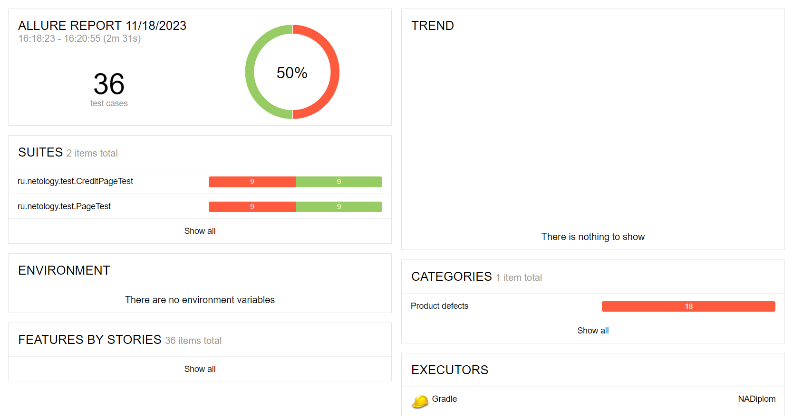
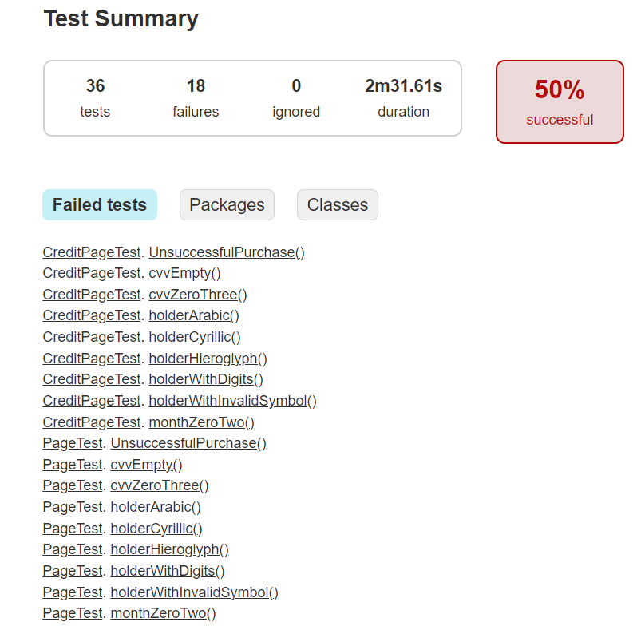

# Отчёт по итогам тестирования

## Краткое описание:
#### Протестированы:
* Функции приложения
* Форма покупки: Номер карты, Месяц, Год, Владелец, CVC/CVV

В ходе тестирования были выявлены баги приложения.

## Количество тест-кейсов:
Было выполнено 36 тест-кейсов.

## Процент успешных и неуспешных тест-кейсов:
18 успешных тестов из 36. 18 тестов выявили баги приложения.

## Allure-репорт

## Gradle-репорт

## Общие рекомендации:
* Отсутствует документация на сервис. Необходимо описание функционала приложения, для более точного тестирования.
* Отредактировать текст во всплывающих окнах. Добавить описание ошибки.
* Устранить баги приложения, описанные в Issues.